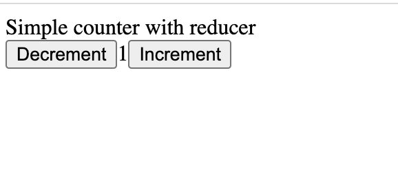

# A demo to show [ReScript](https://github.com/rescript-lang/rescript-compiler) with React under 1K


# Simplicity

- There are only 3 directories under `node_modules`, the [compiler](./node_modules/bs-platform), the [bundler](./node_modules/esbuild) and [@rescript/react](./node_modules/@rescript/react), no node_modules black hole.

- The [bundled output](./src/App.bundle.js) is tiny.
It is *self-contained*, we treat the well established libraries: React and ReactDOM as a blackbox using [import maps](https://github.com/WICG/import-maps) shipped with chrome 89

- Set up an http server, you should see an output as below



- It scales. The ReScript build system can handle more than 10K files in a repo around 1~200ms.


# Build
```
npx bsb -make-world && node ./bundle.js
```

# TODO

We will investigate how to integrate the build system with bundler better.
